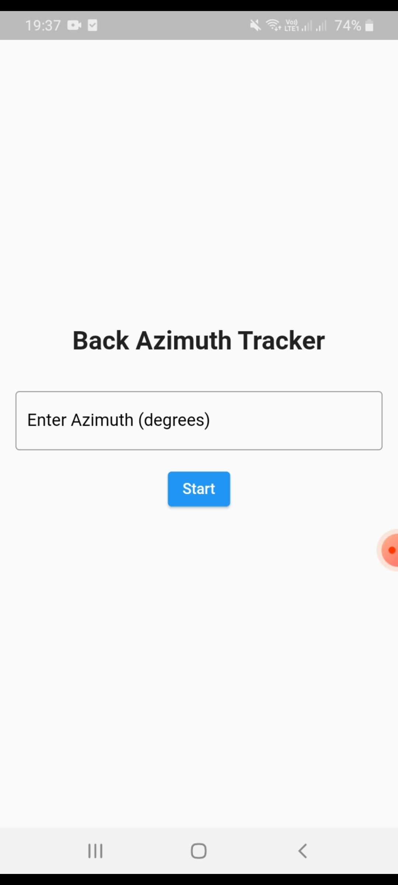
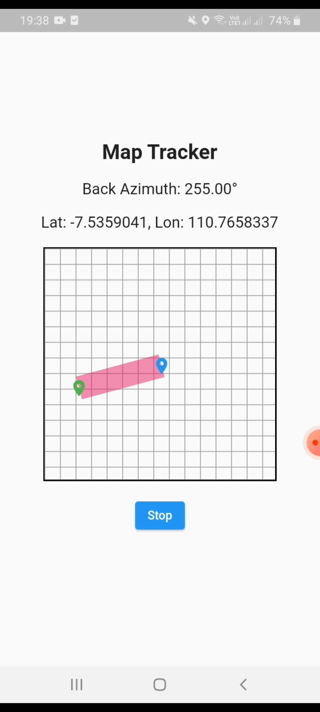

# Azimuth Tracker
| Gambar 1 | Gambar 2 |
|----------|----------|
|  |  |

## 📌 Deskripsi
**Azimuth Tracker** adalah aplikasi berbasis Flutter yang memungkinkan pengguna untuk melacak dan menampilkan pergerakan mereka di dalam **map tiles** secara real-time. Aplikasi ini dirancang untuk menampilkan jalur perjalanan dari lokasi awal ke lokasi tujuan dengan cara yang sederhana dan intuitif.

## 🎯 Fitur Utama
- 🗺 **Peta Interaktif**: Menampilkan pergerakan pengguna secara langsung di dalam map tiles.
- 📍 **Penanda Lokasi**: Menunjukkan lokasi awal dan tujuan pengguna.
- 🚶 **Pemetaan Langkah**: Melacak jalur perjalanan pengguna berdasarkan data lokasi.
- 🎯 **Navigasi Dasar**: Menampilkan arah dan estimasi jarak ke tujuan.

## 🛠 Teknologi yang Digunakan
- **Flutter** - Framework utama untuk pengembangan aplikasi mobile.
- **Dart** - Bahasa pemrograman yang digunakan dalam Flutter.
- **Geolocator** - Untuk mendapatkan data lokasi pengguna secara real-time.

